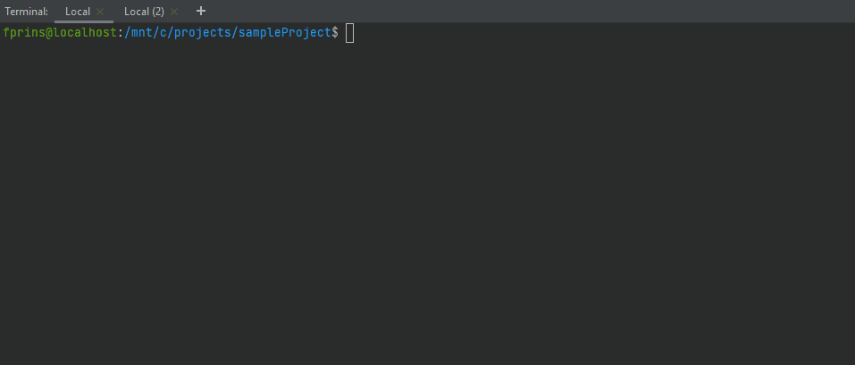
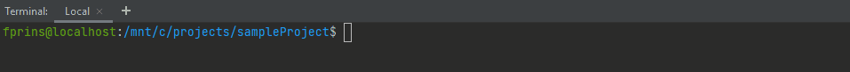
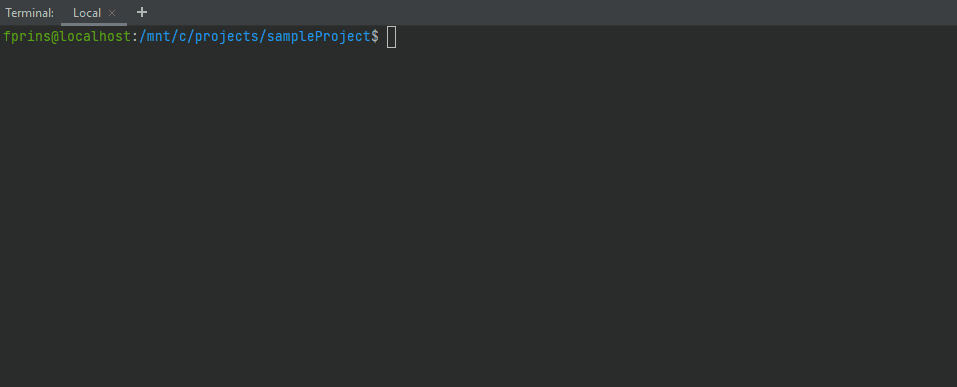
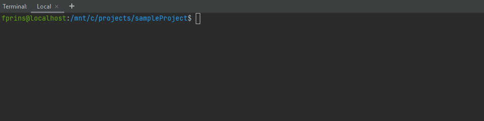
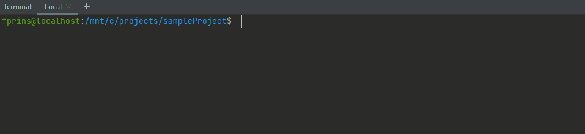

> **Warning**
> 
> As the functionality provided by this package is [now fully provided by composer itself](https://github.com/composer/composer/pull/10313) <sup>Thanks @szepeviktor!</sup>, this package is now abandoned. To migrate, execute the following commands.
> 
> As stated in the docs, it is a good idea to add a requirement to the plugin api, as the exact composer version wasn't available in versions before 2.2.0. 
> ```shell
> composer require composer-plugin-api:>=2.2.0
> ```
> 
> Now you can add the requirement for the actual composer version:
> ```shell
> composer require composer:^2.3.9
> ```
> 
> And finally you can remove this package!
> ```shell
> composer remove prinsfrank/composer-version-lock
> ```
> 
> After this command has run, the "composer-version" and "composer-suggest" keys should be automatically removed from the "extra" section in your composer.json and the entire section should be removed if no other keys are set. If not, remove these keys manually.

# Composer version lock

[](https://codecov.io/gh/PrinsFrank/composer-version-lock)
[](https://github.com/PrinsFrank/composer-version-lock/releases)
[](https://github.com/PrinsFrank/composer-version-lock/blob/main/LICENSE)
[](https://github.com/PrinsFrank/composer-version-lock/issues)

## Why this plugin?

When working with many people in the same codebases, it sometimes is quite a hassle to resolve merge conflicts on the Composer lockfile.

Even when the only changes between branches is that two different packages have been added, the diff on the ```composer.lock``` file can still be several hundred lines. When the only expected changes are the hash and the info about the packages (and maybe some changed dependency versions), differences in composer versions between developers are often the culprit. Sometimes these are big differences, like [support for a Funding section](https://github.com/composer/composer/releases/tag/1.10.0), other times the order of some keys is just changed form one Composer version to the next.

This plugin makes it possible to share the required composer version in the ```composer.json``` file. 

Read more about it [in a post on my personal blog](https://prinsfrank.nl/2021/04/07/Seemingly-random-Composer-lock-changes)

## Getting started

to include this package, simply run;

```sh
composer require prinsfrank/composer-version-lock
```



To set the required composer version for your project, run;

```sh
composer config extra.composer-version {VERSION_CONSTRAINT}
```



Any [Composer constraint](https://getcomposer.org/doc/articles/versions.md#versions-and-constraints) can be used as the ```composer/semver``` package is used to determine if the current composer version satisfies the version constraint.

To get your current version, run ```composer --version```.

> **Note:** When no composer version is set, an error is displayed with instructions on how to enforce your current Composer version.

## How it works

### Commands that change the lock file 
Some of the composer commands change the ```composer.lock```:
- update
- remove
- require

Whenever a developer executes any of the above commands with a Composer version that doesn't satisfy the version constraint, they will get the following error, with the command aborting:



> **Note:** When the version constraint is not an exact version or a next significant operator it is not possible to deduce a matching version so ```composer self-update {version}``` is displayed instead.

### Commands that don't change the lock file

When the developer executes any other command without a satisfiable version, they will just get a warning, with Composer continuing:



### Information when using the correct version

When the developer is using a Composer version that satisfies the constraint, the following message will be displayed:



## Options

### Suggested version

When using a version constraint that has multiple valid versions, you might want to suggest a specific version.
For example, when using the version constraint `1.10.14 || 1.10.15`, this plugin doesn't know what version to suggest as either of them is a valid version. When you specifically want to suggest `1.10.15`, you can do that by setting the `composer-suggest` extra key using the following command:

```sh
composer config extra.composer-suggest {VERSION}
```

> When a suggested version is set, but it it is not correct according to the version constraint, you will get a console error and the plugin will prevent any further actions until you resolve this issue. Either set a correct suggested version or remove the suggested version. 

## Version update strategies

### Implementing a "grace period"

When you have a main/master branch that is locked to a specific version of Composer - for example `2.0.5` - and a couple of feature branches that recently have been branched from master, you might run into issues where upgrading the Composer version on master results in you having to switch Composer versions every time you switch between the master and feature branches.

A good strategy here can be to use a grace period as follows:
1. The initial version constraint is `2.0.5`
2. Add the old and new versions seperated by two pipe characters as the new version constraint: `2.0.5 || 2.0.6`.
3. After a while the version constraint for both the old and new versions should live in all branches. You can now require the new version `2.0.6`

> When the plugin is removed with the command ```composer remove prinsfrank/composer-version-lock```, the ```composer-version``` and ```composer-suggest``` settings in the ```extra``` section in the composer.json are also cleaned up. When the remaining extra section is then empty, it is removed.

## Examples of changes to lock files between Composer versions
- The url of the readme section changed between [https://getcomposer.org/doc/01-basic-usage.md#composer-lock-the-lock-file](https://getcomposer.org/doc/01-basic-usage.md#composer-lock-the-lock-file) and [https://getcomposer.org/doc/01-basic-usage.md#installing-dependencies](https://getcomposer.org/doc/01-basic-usage.md#installing-dependencies)
- The "hash" section was renamed to "content-hash" or the other way round.
- The "hash" or "content-hash" was recalculated even when the rest of the composer.lock hasn't changed.
- The "support" section was added or removed with individual packages.
- The "time" section has now added or removed a "T" and timezone offset indicating localized timestamps with individual packages.
- A "funding" section was added or removed with individual packages.
- A "plugin-api-version" section was added or removed.
- and more ...

## Developing

If you want to improve this plugin and create a PR you're more than welcome to do so!

To have autocomplete when developing locally, run ```composer u``` to switch to the most recent composer/composer version, and ```composer u --prefer-lowest``` to switch to the first composer/composer version.

To actually test the package, run ```composer self-update {VERSION}``` to switch to the composer version the system is using. 

Tests can be run with ```composer test``` or ```vendor/bin/phpunit```, and are automatically run on a push or PR to master for every stable composer version and every PHP version.
